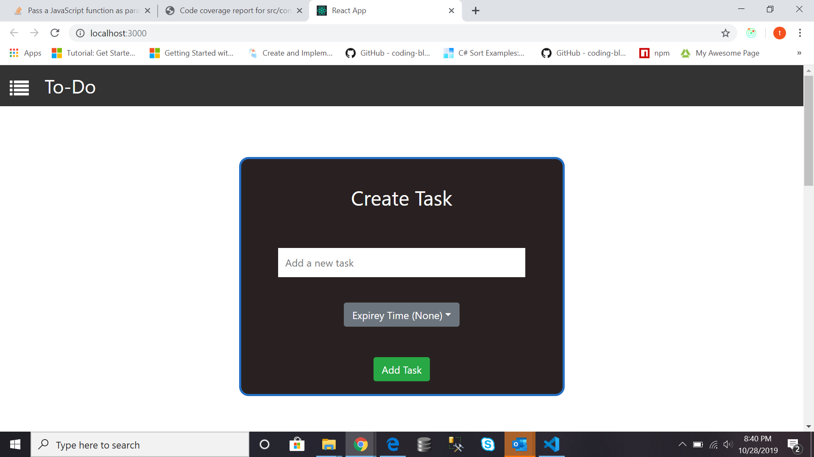
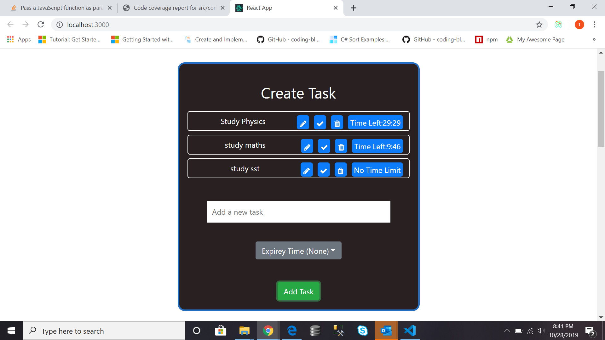
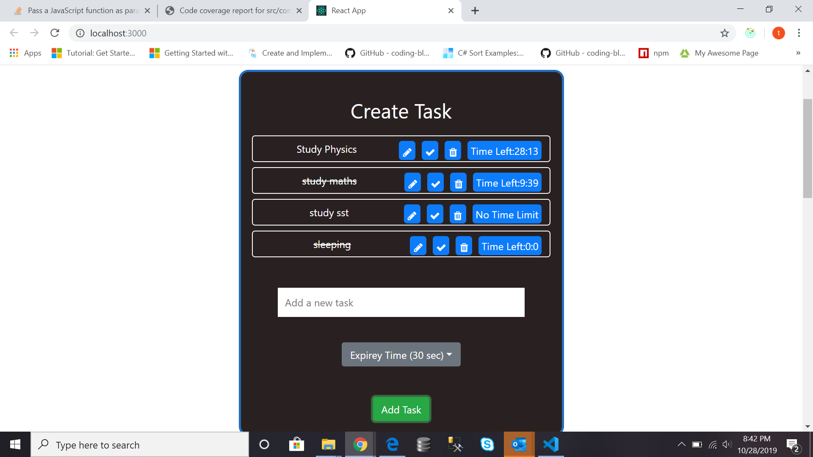
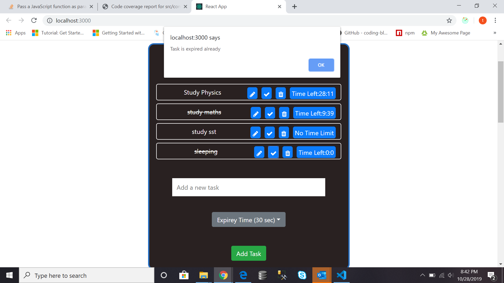
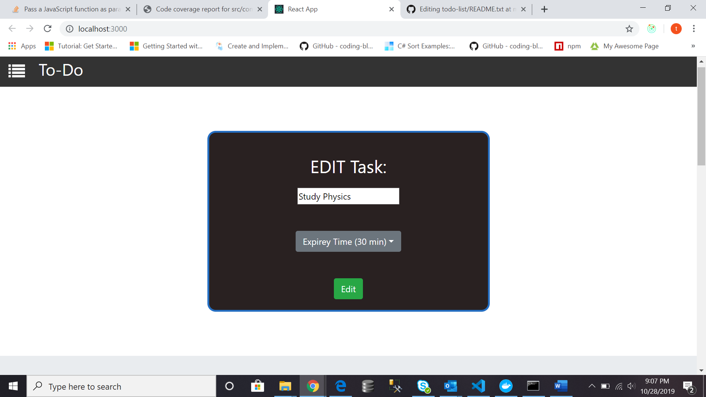
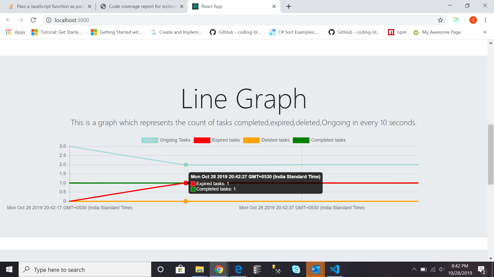
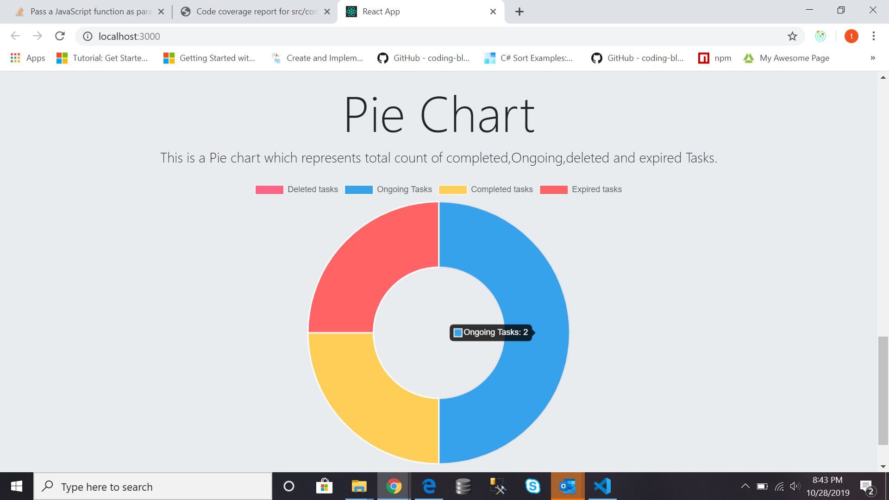

# TO-Do App
In this project you can create a task with its expire time,edit a task,complete a task and delete a task.by default expire time is none.
## Installation
download  the project and install npm
```bash
npm i
```
## Usage
I use reactjs,react-icons,redux and reactstrap in this project.
## Start
run command
```bash
cd toto-list
```
```bash
npm start
```
## Screenshots
Create task Page


If a Task is completed or expired then a line through  the title of task is shown.

If you try to complete a expired task then alert is shown "this task is already expired".

Edit Page

Line chart showing total count of expired,deleted,completed,ongoing task in each sec.

Pie chart showing total count of expired,deleted,completed,ongoing task in each sec.


