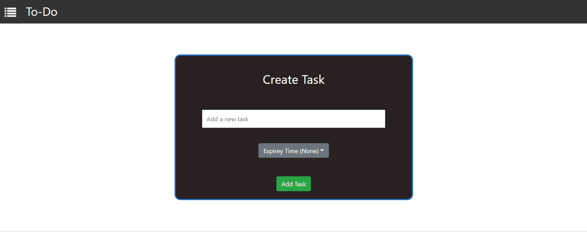

# TO-Do App
In this project you can create a task with its expire time,edit a task,complete a task and delete a task.by default expire time is none.
## Installation
Clone this repository<br/>
```bash
cd toto-list
```
```bash
npm i
```
## Usage
This Project uses reactjs,react-icons,redux, reactstrap and Chartjs.
## Start

```bash
npm start
```
## Demo




